# Biểu đồ cho ứng dụng "Gotta Go"

## 1. Chức năng đăng nhập

### 1.1. Bảng đặc tả chức năng đăng nhập

```plantuml
@startuml
skinparam {
  defaultFontName Arial
  defaultFontSize 12
}



salt
{
{+
 | <&person> STT | Tên chức năng | Mô tả | Điều kiện | Dòng sự kiện
 | 1 | Đăng nhập | Cho phép người dùng đăng nhập vào hệ thống bằng tài khoản hiện có | Tài khoản Email và mật khẩu phải tồn tại trong hệ thống dữ liệu. Có kết nối Internet. | Người dùng nhập vào Email, mật khẩu. Hệ thống kiểm tra xem email và mật khẩu có đúng hay không. Nếu đúng, hiển thị thông báo đăng nhập thành công, chuyển đến trang chính. Nếu sai, hiển thị thông báo lỗi.
}
}
@enduml
```

### 1.2. Biểu đồ Activity cho chức năng đăng nhập

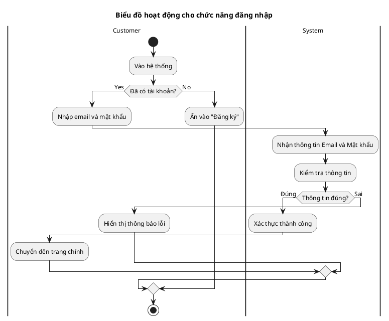

### 1.3. Biểu đồ Sequence cho chức năng đăng nhập

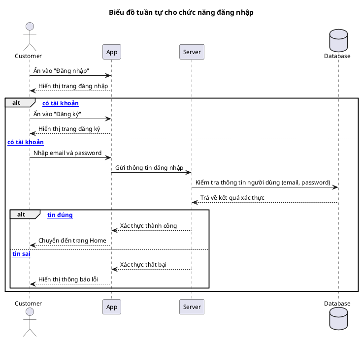

### 1.4. Biểu đồ Class cho chức năng đăng nhập

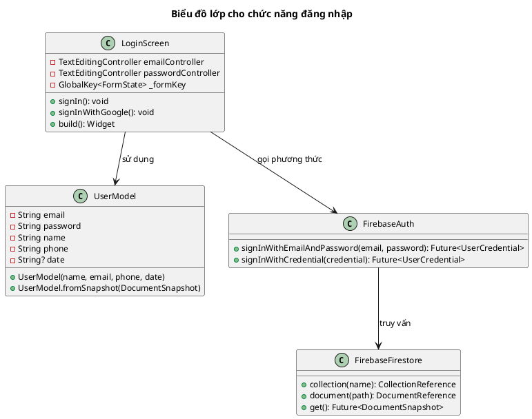

### 1.5. Bảng dữ liệu cho chức năng đăng nhập

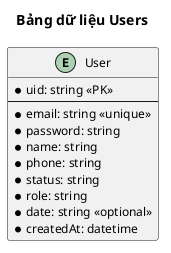

## 2. Chức năng đăng ký

### 2.1. Bảng đặc tả chức năng đăng ký

```plantuml
@startuml
skinparam {
  defaultFontName Arial
  defaultFontSize 12
}



salt
{
{+
 | <&person> STT | Tên chức năng | Mô tả | Điều kiện | Dòng sự kiện
 | 1 | Đăng ký | Cho phép người dùng tạo tài khoản mới để sử dụng dịch vụ của ứng dụng. | Tài khoản Email dùng đăng ký là tài khoản chưa được đăng ký trước đó, kết nối Internet. | Người dùng nhập vào Email, password và fullname. Hệ thống kiểm tra xem email đã tồn tại hay chưa. Nếu chưa tồn tại, hệ thống kiểm tra tính hợp lệ của email. Nếu đúng định dạng, hiển thị thông báo đăng ký thành công, ngược lại hiển thị thông báo lỗi.
}
}
@enduml
```

### 2.2. Biểu đồ Activity cho chức năng đăng ký

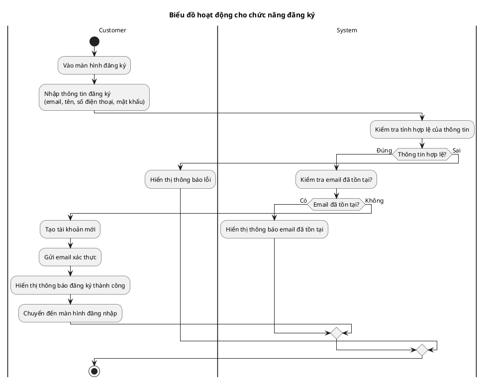

### 2.3. Biểu đồ Sequence cho chức năng đăng ký

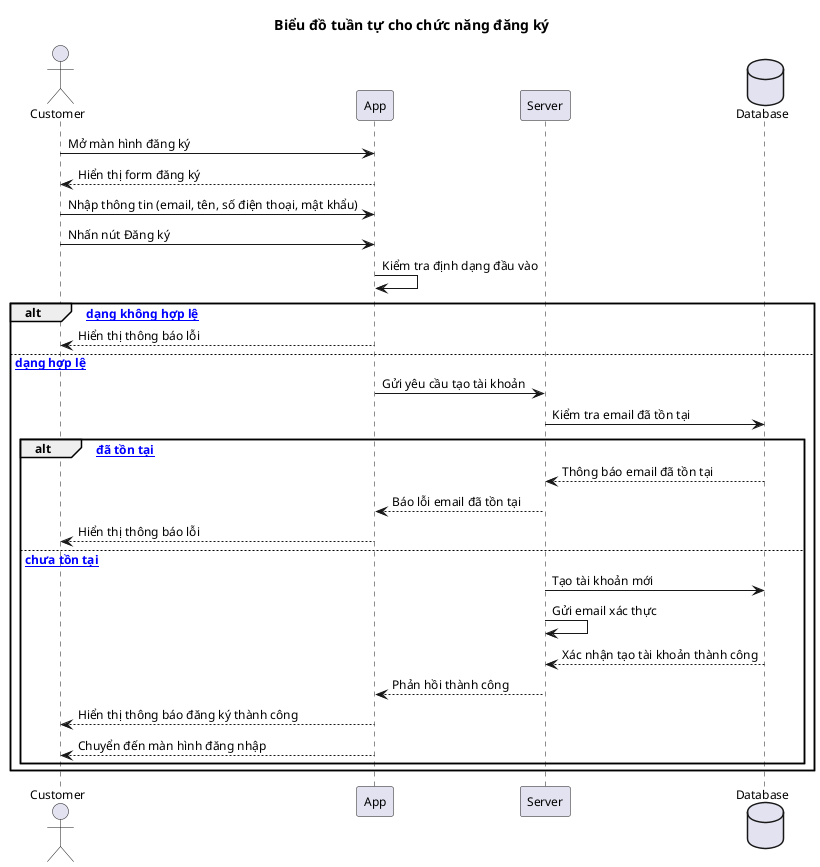

### 2.4. Biểu đồ Class cho chức năng đăng ký

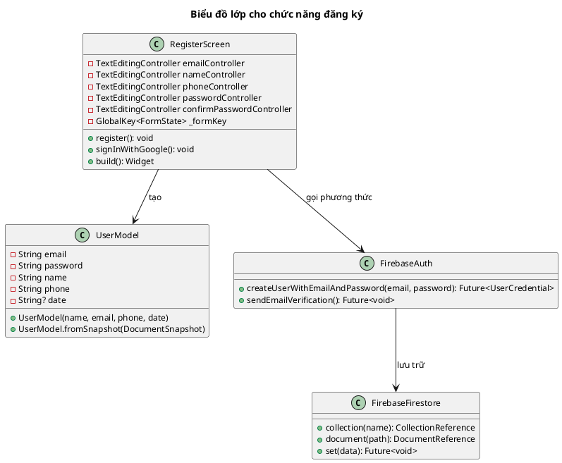

### 2.5. Bảng dữ liệu cho chức năng đăng ký


## 3. Chức năng đăng xuất

### 3.1. Bảng đặc tả chức năng đăng xuất

```plantuml
@startuml
skinparam {
  defaultFontName Arial
  defaultFontSize 12
}



salt
{
{+
 | <&person> STT | Tên chức năng | Mô tả | Điều kiện | Dòng sự kiện
 | 1 | Đăng xuất | Cho phép người dùng đăng xuất khỏi tài khoản hiện tại | Người dùng đã đăng nhập vào hệ thống | Người dùng nhấp vào nút đăng xuất. Hệ thống xóa thông tin đăng nhập hiện tại. Chuyển đến màn hình đăng nhập.
}
}
@enduml
```

### 3.2. Biểu đồ Activity cho chức năng đăng xuất

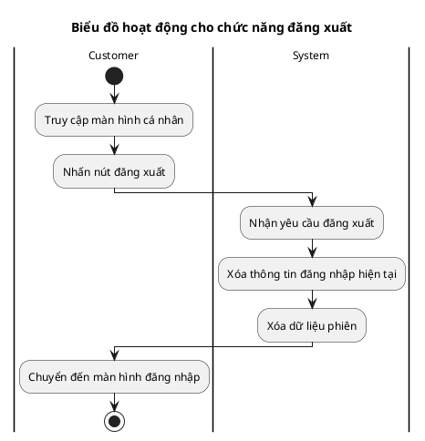

### 3.3. Biểu đồ Sequence cho chức năng đăng xuất

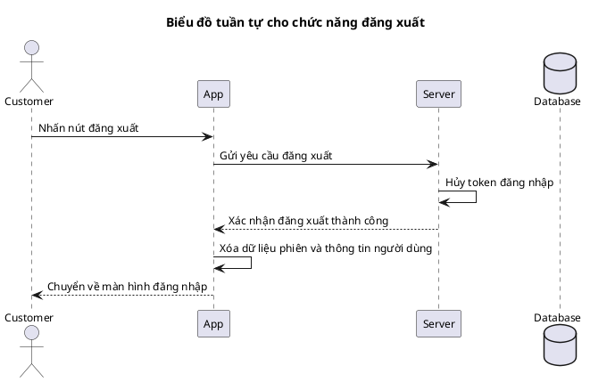

### 3.4. Biểu đồ Class cho chức năng đăng xuất

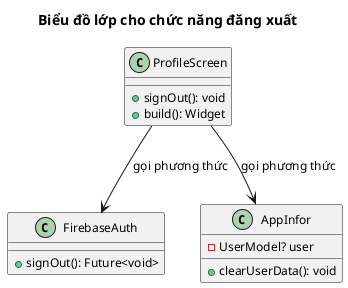

### 3.5. Bảng dữ liệu cho chức năng đăng xuất

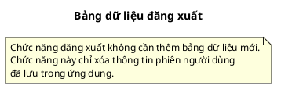

## 4. Chức năng tìm kiếm chuyến đi

### 4.1. Bảng đặc tả chức năng tìm kiếm chuyến đi

```plantuml
@startuml
skinparam {
  defaultFontName Arial
  defaultFontSize 12
}



salt
{
{+
 | <&person> STT | Tên chức năng | Mô tả | Điều kiện | Dòng sự kiện
 | 1 | Tìm kiếm chuyến đi | Cho phép người dùng tìm kiếm các chuyến đi theo địa điểm xuất phát, điểm đến và ngày đi | Người dùng phải chọn địa điểm xuất phát, điểm đến và ngày đi. Kết nối Internet | Người dùng chọn điểm xuất phát, điểm đến và ngày đi. Hệ thống tìm kiếm các chuyến đi phù hợp từ cơ sở dữ liệu. Hiển thị danh sách các chuyến đi thỏa mãn điều kiện tìm kiếm.
}
}
@enduml
```

### 4.2. Biểu đồ Activity cho chức năng tìm kiếm chuyến đi

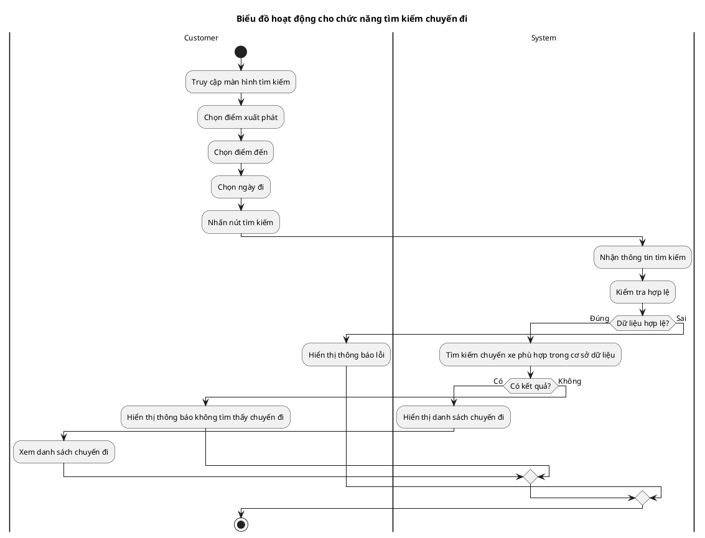

### 4.3. Biểu đồ Sequence cho chức năng tìm kiếm chuyến đi

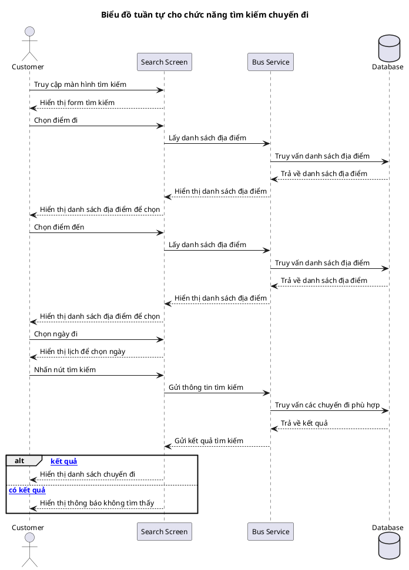

### 4.4. Biểu đồ Class cho chức năng tìm kiếm chuyến đi

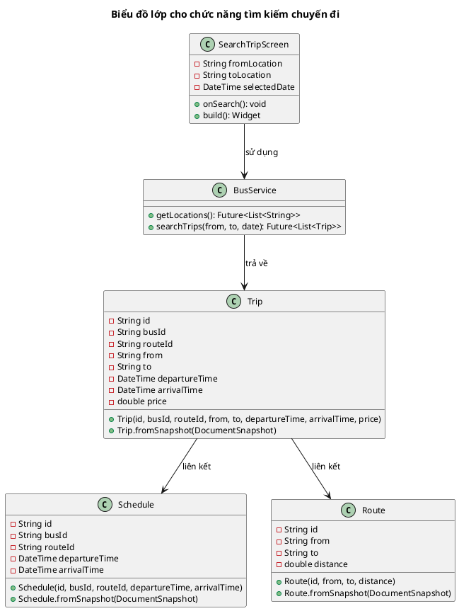

### 4.5. Bảng dữ liệu cho chức năng tìm kiếm chuyến đi

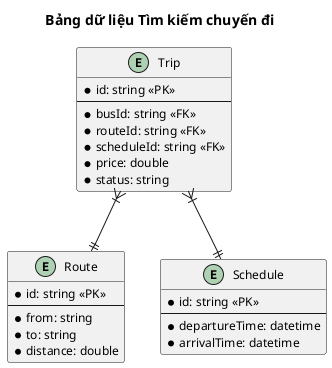

## 5. Chức năng lịch sử tìm kiếm

### 5.1. Bảng đặc tả chức năng lịch sử tìm kiếm

```plantuml
@startuml
skinparam {
  defaultFontName Arial
  defaultFontSize 12
}


salt
{
{+
 | <&person> STT | Tên chức năng | Mô tả | Điều kiện | Dòng sự kiện
 | 1 | Lịch sử tìm kiếm | Cho phép người dùng xem lại và sử dụng nhanh các tìm kiếm đã thực hiện trước đó | Người dùng đã đăng nhập vào hệ thống và đã thực hiện tìm kiếm trước đó | Người dùng truy cập vào màn hình lịch sử tìm kiếm. Hệ thống hiển thị danh sách các lượt tìm kiếm trước đó. Người dùng có thể chọn một lịch sử tìm kiếm để thực hiện lại tìm kiếm hoặc xóa lịch sử.
}
}
@enduml
```

### 5.2. Biểu đồ Activity cho chức năng lịch sử tìm kiếm

```plantuml
@startuml
skinparam {
  defaultFontName Arial
  defaultFontSize 12
}


title Biểu đồ hoạt động cho chức năng lịch sử tìm kiếm

|Customer|
start
:Truy cập màn hình lịch sử tìm kiếm;
|System|
:Lấy dữ liệu lịch sử tìm kiếm từ cơ sở dữ liệu;
if (Có dữ liệu lịch sử?) then (Có)
  :Hiển thị danh sách lịch sử tìm kiếm;
  |Customer|
  :Xem danh sách lịch sử tìm kiếm;
  
  if (Muốn thực hiện lại tìm kiếm?) then (Có)
    :Chọn một mục từ lịch sử;
    |System|
    :Lấy thông tin tìm kiếm (điểm đi, điểm đến, ngày);
    :Thực hiện tìm kiếm với thông tin đã lưu;
    :Hiển thị kết quả tìm kiếm;
    |Customer|
  else (Không)
    if (Muốn xóa lịch sử?) then (Có)
      :Chọn mục cần xóa;
      :Nhấn nút xóa;
      |System|
      :Xóa mục khỏi lịch sử;
      :Cập nhật giao diện;
      |Customer|
    else (Không)
      :Thoát màn hình lịch sử;
    endif
  endif
else (Không)
  :Hiển thị thông báo không có lịch sử tìm kiếm;
  |Customer|
endif

stop
@enduml
```

### 5.3. Biểu đồ Sequence cho chức năng lịch sử tìm kiếm

```plantuml
@startuml
skinparam {
  defaultFontName Arial
  defaultFontSize 12
}


title Biểu đồ tuần tự cho chức năng lịch sử tìm kiếm

actor Customer
participant "History Screen" as App
participant "Search History Service" as Service
database Database

Customer -> App: Truy cập màn hình lịch sử tìm kiếm
App -> Service: Lấy lịch sử tìm kiếm của người dùng
Service -> Database: Truy vấn lịch sử tìm kiếm
Database --> Service: Trả về dữ liệu lịch sử
Service --> App: Gửi dữ liệu lịch sử
App --> Customer: Hiển thị danh sách lịch sử tìm kiếm

alt [Chọn lịch sử để tìm kiếm lại]
  Customer -> App: Chọn một mục từ lịch sử
  App -> Service: Lấy chi tiết tìm kiếm
  Service -> Database: Truy vấn chi tiết tìm kiếm
  Database --> Service: Trả về chi tiết
  Service --> App: Gửi thông tin chi tiết
  App --> Customer: Chuyển đến màn hình tìm kiếm với thông tin đã điền
else [Xóa lịch sử tìm kiếm]
  Customer -> App: Chọn xóa một mục lịch sử
  App -> Service: Gửi yêu cầu xóa
  Service -> Database: Xóa mục khỏi cơ sở dữ liệu
  Database --> Service: Xác nhận xóa thành công
  Service --> App: Xác nhận xóa thành công
  App --> Customer: Cập nhật giao diện
end
@enduml
```

### 5.4. Biểu đồ Class cho chức năng lịch sử tìm kiếm

```plantuml
@startuml
skinparam {
  defaultFontName Arial
  defaultFontSize 12
}


title Biểu đồ lớp cho chức năng lịch sử tìm kiếm

class SearchHistoryScreen {
  +getSearchHistory(): void
  +deleteHistory(id): void
  +useHistoryItem(item): void
  +build(): Widget
}

class SearchHistoryService {
  +getSearchHistory(userId): Future<List<SearchHistory>>
  +saveSearchHistory(history): Future<void>
  +deleteSearchHistory(id): Future<void>
}

class SearchHistory {
  -String id
  -String userId
  -String from
  -String to
  -DateTime date
  -DateTime searchTime
  +SearchHistory(id, userId, from, to, date, searchTime)
  +SearchHistory.fromSnapshot(DocumentSnapshot)
  +toJson(): Map<String, dynamic>
}

SearchHistoryScreen --> SearchHistoryService: sử dụng
SearchHistoryService --> SearchHistory: quản lý

@enduml
```

### 5.5. Bảng dữ liệu cho chức năng lịch sử tìm kiếm

```plantuml
@startuml
skinparam {
  defaultFontName Arial
  defaultFontSize 12
}


title Bảng dữ liệu Lịch sử tìm kiếm

entity "SearchHistory" as searchHistory {
  * id: string <<PK>>
  --
  * userId: string <<FK>>
  * from: string
  * to: string
  * date: datetime
  * searchTime: datetime
}

entity "User" as user {
  * id: string <<PK>>
  --
  * email: string
  * name: string
}

searchHistory }o--|| user
@enduml
```

## 6. Chức năng lộ trình phổ biến

### 6.1. Bảng đặc tả chức năng lộ trình phổ biến

```plantuml
@startuml
skinparam {
  defaultFontName Arial
  defaultFontSize 12
}


salt
{
{+
 | <&person> STT | Tên chức năng | Mô tả | Điều kiện | Dòng sự kiện
 | 1 | Lộ trình phổ biến | Hiển thị danh sách các lộ trình phổ biến nhất để người dùng có thể chọn nhanh | Có kết nối Internet và hệ thống đã có dữ liệu về các lộ trình | Người dùng truy cập màn hình chính. Hệ thống hiển thị danh sách các lộ trình phổ biến dựa trên số lượng đặt vé. Người dùng có thể chọn một lộ trình để tiến hành tìm kiếm và đặt vé.
}
}
@enduml
```

### 6.2. Biểu đồ Activity cho chức năng lộ trình phổ biến

```plantuml
@startuml
skinparam {
  defaultFontName Arial
  defaultFontSize 12
}


title Biểu đồ hoạt động cho chức năng lộ trình phổ biến

|Customer|
start
:Mở ứng dụng;
:Truy cập màn hình chính;
|System|
:Lấy dữ liệu lộ trình phổ biến từ cơ sở dữ liệu;
:Xếp hạng các lộ trình dựa trên số lượng đặt vé;
:Hiển thị danh sách lộ trình phổ biến;
|Customer|
:Xem danh sách lộ trình phổ biến;
if (Muốn chọn lộ trình phổ biến?) then (Có)
  :Chọn một lộ trình;
  |System|
  :Lấy thông tin lộ trình (điểm đi, điểm đến);
  :Điền thông tin vào form tìm kiếm;
  :Chuyển đến màn hình chọn ngày;
  |Customer|
  :Chọn ngày đi;
  |System|
  :Thực hiện tìm kiếm với lộ trình đã chọn;
  :Hiển thị kết quả tìm kiếm;
  |Customer|
else (Không)
  :Tiếp tục sử dụng ứng dụng;
endif
stop
@enduml
```

### 6.3. Biểu đồ Sequence cho chức năng lộ trình phổ biến

```plantuml
@startuml
skinparam {
  defaultFontName Arial
  defaultFontSize 12
}


title Biểu đồ tuần tự cho chức năng lộ trình phổ biến

actor Customer
participant "Home Screen" as App
participant "Popular Routes Service" as Service
database Database

Customer -> App: Truy cập màn hình chính
App -> Service: Yêu cầu lấy lộ trình phổ biến
Service -> Database: Truy vấn lộ trình phổ biến
Database --> Service: Trả về dữ liệu
Service --> App: Gửi danh sách lộ trình phổ biến
App --> Customer: Hiển thị lộ trình phổ biến

Customer -> App: Chọn một lộ trình phổ biến
App -> Service: Lấy chi tiết lộ trình
Service -> Database: Truy vấn chi tiết lộ trình
Database --> Service: Trả về chi tiết
Service --> App: Hiển thị danh sách địa điểm
App --> Customer: Hiển thị danh sách địa điểm để chọn

Customer -> App: Chọn ngày đi
App -> Service: Gửi yêu cầu tìm kiếm chuyến đi
Service -> Database: Truy vấn chuyến đi theo lộ trình và ngày
Database --> Service: Trả về kết quả
Service --> App: Gửi kết quả tìm kiếm
App --> Customer: Hiển thị danh sách chuyến đi
@enduml
```

### 6.4. Biểu đồ Class cho chức năng lộ trình phổ biến

```plantuml
@startuml
skinparam {
  defaultFontName Arial
  defaultFontSize 12
}


title Biểu đồ lớp cho chức năng lộ trình phổ biến

class HomeScreen {
  -List<PopularRoute> popularRoutes
  +getPopularRoutes(): void
  +onRouteSelected(route): void
  +build(): Widget
}

class PopularRoutesService {
  +getPopularRoutes(): Future<List<PopularRoute>>
  +getTripsByRoute(routeId, date): Future<List<Trip>>
}

class PopularRoute {
  -String id
  -String from
  -String to
  -int bookingCount
  -String imageUrl
  +PopularRoute(id, from, to, bookingCount, imageUrl)
  +PopularRoute.fromSnapshot(DocumentSnapshot)
}

class Trip {
  -String id
  -String busId
  -String routeId
  -String from
  -String to
  -DateTime departureTime
  -DateTime arrivalTime
  -double price
  +Trip(id, busId, routeId, from, to, departureTime, arrivalTime, price)
  +Trip.fromSnapshot(DocumentSnapshot)
}

HomeScreen --> PopularRoutesService: sử dụng
PopularRoutesService --> PopularRoute: trả về
PopularRoutesService --> Trip: trả về

@enduml
```

### 6.5. Bảng dữ liệu cho chức năng lộ trình phổ biến

```plantuml
@startuml
skinparam {
  defaultFontName Arial
  defaultFontSize 12
}


title Bảng dữ liệu Lộ trình phổ biến

entity "PopularRoute" as popularRoute {
  * id: string <<PK>>
  --
  * from: string
  * to: string
  * bookingCount: int
  * imageUrl: string
}

entity "Trip" as trip {
  * id: string <<PK>>
  --
  * routeId: string <<FK>>
  * busId: string
  * from: string
  * to: string
  * departureTime: datetime
  * arrivalTime: datetime
  * price: double
}

entity "Route" as route {
  * id: string <<PK>>
  --
  * from: string
  * to: string
  * distance: double
}

popularRoute ||--o{ trip
trip }|--|| route
@enduml
```

## 7. Chức năng đặt vé

### 7.1. Bảng đặc tả chức năng đặt vé

```plantuml
@startuml
skinparam {
  defaultFontName Arial
  defaultFontSize 12
}


salt
{
{+
 | <&person> STT | Tên chức năng | Mô tả | Điều kiện | Dòng sự kiện
 | 1 | Đặt vé | Cho phép người dùng đặt vé cho một chuyến đi cụ thể | Người dùng đã đăng nhập, đã chọn chuyến đi và có kết nối Internet | Người dùng chọn một chuyến đi từ kết quả tìm kiếm. Hệ thống hiển thị chi tiết chuyến đi. Người dùng chọn chỗ ngồi trên xe. Người dùng nhập thông tin hành khách. Hệ thống tạo đơn đặt vé và chuyển đến màn hình thanh toán.
}
}
@enduml
```

### 7.2. Biểu đồ Activity cho chức năng đặt vé

```plantuml
@startuml
skinparam {
  defaultFontName Arial
  defaultFontSize 12
}


title Biểu đồ hoạt động cho chức năng đặt vé

|Customer|
start
:Chọn chuyến đi từ kết quả tìm kiếm;
|System|
:Hiển thị chi tiết chuyến đi;
:Hiển thị sơ đồ chỗ ngồi;
|Customer|
:Chọn chỗ ngồi;
|System|
:Kiểm tra tình trạng chỗ ngồi;
if (Chỗ ngồi có sẵn?) then (Có)
  :Đánh dấu chỗ ngồi đã chọn;
  |Customer|
  :Nhập thông tin hành khách;
  :Xác nhận đặt vé;
  |System|
  :Tạo đơn đặt vé;
  :Lưu thông tin đặt vé;
  :Chuyển đến màn hình thanh toán;
  |Customer|
else (Không)
  :Hiển thị thông báo chỗ ngồi không có sẵn;
  |Customer|
  :Chọn chỗ ngồi khác;
endif
stop
@enduml
```

### 7.3. Biểu đồ Sequence cho chức năng đặt vé

```plantuml
@startuml
skinparam {
  defaultFontName Arial
  defaultFontSize 12
}


title Biểu đồ tuần tự cho chức năng đặt vé

actor Customer
participant "Trip List Screen" as TripScreen
participant "Seat Selection Screen" as SeatScreen
participant "Booking Information Screen" as BookingScreen
participant "Booking Service" as Service
database Database

Customer -> TripScreen: Chọn chuyến đi
TripScreen -> Service: Lấy thông tin chi tiết chuyến đi
Service -> Database: Truy vấn thông tin chuyến đi
Database --> Service: Trả về thông tin
Service --> TripScreen: Hiển thị thông tin
TripScreen --> Customer: Hiển thị chi tiết chuyến đi

Customer -> TripScreen: Chọn "Đặt vé"
TripScreen -> SeatScreen: Chuyển đến màn hình chọn chỗ
SeatScreen -> Service: Lấy sơ đồ chỗ ngồi
Service -> Database: Truy vấn sơ đồ chỗ ngồi
Database --> Service: Trả về sơ đồ
Service --> SeatScreen: Hiển thị sơ đồ chỗ ngồi
SeatScreen --> Customer: Hiển thị sơ đồ chỗ ngồi

Customer -> SeatScreen: Chọn chỗ ngồi
SeatScreen -> Service: Kiểm tra tình trạng chỗ ngồi
Service -> Database: Truy vấn tình trạng chỗ ngồi
Database --> Service: Trả về tình trạng

alt [Chỗ ngồi có sẵn]
  Service --> SeatScreen: Xác nhận chỗ ngồi có sẵn
  SeatScreen --> Customer: Hiển thị chỗ đã chọn
  
  Customer -> SeatScreen: Xác nhận chọn chỗ
  SeatScreen -> BookingScreen: Chuyển đến màn hình thông tin đặt vé
  BookingScreen --> Customer: Hiển thị form thông tin
  
  Customer -> BookingScreen: Nhập thông tin hành khách
  Customer -> BookingScreen: Xác nhận đặt vé
  BookingScreen -> Service: Gửi thông tin đặt vé
  Service -> Database: Lưu thông tin đặt vé
  Database --> Service: Xác nhận lưu thành công
  Service --> BookingScreen: Trả về thông tin vé
  BookingScreen --> Customer: Chuyển đến màn hình thanh toán
else [Chỗ ngồi không có sẵn]
  Service --> SeatScreen: Thông báo chỗ ngồi không có sẵn
  SeatScreen --> Customer: Hiển thị thông báo lỗi
end
@enduml
```

### 7.4. Biểu đồ Class cho chức năng đặt vé

```plantuml
@startuml
skinparam {
  defaultFontName Arial
  defaultFontSize 12
}


title Biểu đồ lớp cho chức năng đặt vé

class TripScreen {
  -List<Trip> trips
  +getTripDetails(tripId): void
  +onBookTrip(trip): void
  +build(): Widget
}

class SeatSelectionScreen {
  -String tripId
  -List<String> selectedSeats
  -SeatLayout seatLayout
  +getSeatLayout(): void
  +onSeatSelected(seat): void
  +confirmSelection(): void
  +build(): Widget
}

class BookingInformationScreen {
  -String tripId
  -List<String> selectedSeats
  -Trip tripDetails
  -TextEditingController nameController
  -TextEditingController phoneController
  +createBooking(): void
  +build(): Widget
}

class BookingService {
  +getTripDetails(tripId): Future<Trip>
  +getSeatLayout(busId): Future<SeatLayout>
  +checkSeatAvailability(tripId, seats): Future<bool>
  +createBooking(booking): Future<Ticket>
}

class Trip {
  -String id
  -String busId
  -String routeId
  -String from
  -String to
  -DateTime departureTime
  -DateTime arrivalTime
  -double price
  +Trip(id, busId, routeId, from, to, departureTime, arrivalTime, price)
  +Trip.fromSnapshot(DocumentSnapshot)
}

class SeatLayout {
  -String id
  -int rows
  -int columns
  -List<String> availableSeats
  -List<String> bookedSeats
  +SeatLayout(id, rows, columns, availableSeats, bookedSeats)
  +SeatLayout.fromSnapshot(DocumentSnapshot)
}

class Ticket {
  -String id
  -String customerId
  -String tripId
  -List<String> seats
  -double price
  -String status
  -DateTime bookingTime
  -DateTime departureTime
  -DateTime arrivalTime
  -String from
  -String to
  +Ticket(id, customerId, tripId, seats, price, status, bookingTime, departureTime, arrivalTime, from, to)
  +Ticket.fromSnapshot(DocumentSnapshot)
}

TripScreen --> BookingService: sử dụng
SeatSelectionScreen --> BookingService: sử dụng
BookingInformationScreen --> BookingService: sử dụng
BookingService --> Ticket: tạo và quản lý
BookingService --> SeatLayout: tạo và quản lý
BookingService --> Ticket: tạo và quản lý

@enduml
```

### 7.5. Bảng dữ liệu cho chức năng đặt vé

```plantuml
@startuml
skinparam {
  defaultFontName Arial
  defaultFontSize 12
}


title Bảng dữ liệu Đặt vé

entity "Ticket" as ticket {
  * id: string <<PK>>
  --
  * customerId: string <<FK>>
  * tripId: string <<FK>>
  * price: double
  * status: string
  * paymentMethod: string
  * paymentStatus: string
  * transactionNo: string
  * bookingTime: datetime
  * paymentTime: datetime
}

entity "SeatLayout" as seatLayout {
  * id: string <<PK>>
  --
  * rows: int
  * columns: int
}

entity "Trip" as trip {
  * id: string <<PK>>
  --
  * busId: string
  * routeId: string
  * scheduleId: string
  * price: double
  * status: string
}

entity "User" as user {
  * id: string <<PK>>
  --
  * email: string
  * name: string
}

ticket }o--|| user
ticket }o--|| trip
ticket }o--|| seatLayout
@enduml
```

## 8. Chức năng thanh toán VNPAY

### 8.1. Bảng đặc tả chức năng thanh toán VNPAY

```plantuml
@startuml
skinparam {
  defaultFontName Arial
  defaultFontSize 12
}


salt
{
{+
 | <&person> STT | Tên chức năng | Mô tả | Điều kiện | Dòng sự kiện
 | 1 | Thanh toán VNPAY | Cho phép người dùng thanh toán đơn hàng qua cổng thanh toán VNPAY | Người dùng đã đăng nhập, đã chọn chuyến đi và có kết nối Internet và có tài khoản ngân hàng liên kết với VNPAY | Người dùng chọn thanh toán qua VNPAY. Hệ thống tạo URL thanh toán và chuyển đến trang web VNPAY. Người dùng thực hiện thanh toán trên cổng VNPAY. Sau khi thanh toán, người dùng được chuyển về ứng dụng và nhận thông báo kết quả thanh toán.
}
}
@enduml
```

### 8.2. Biểu đồ Activity cho chức năng thanh toán VNPAY

```plantuml
@startuml
skinparam {
  defaultFontName Arial
  defaultFontSize 12
}


title Biểu đồ hoạt động cho chức năng thanh toán VNPAY

|Customer|
start
:Chọn phương thức thanh toán VNPAY;
|System|
:Tạo thông tin đơn hàng;
:Tạo URL thanh toán VNPAY;
:Mở WebView với URL thanh toán;
|VNPAY Gateway|
:Hiển thị trang thanh toán VNPAY;
|Customer|
:Chọn ngân hàng thanh toán;
:Nhập thông tin thanh toán;
:Xác nhận thanh toán;
|VNPAY Gateway|
:Xử lý giao dịch;
if (Giao dịch thành công?) then (Có)
  :Gửi kết quả thành công về ứng dụng;
  |System|
  :Cập nhật trạng thái đơn hàng thành "Đã thanh toán";
  :Tạo vé điện tử;
  :Hiển thị thông báo thanh toán thành công;
  |Customer|
  :Xem chi tiết vé;
else (Không)
  :Gửi kết quả thất bại về ứng dụng;
  |System|
  :Hiển thị thông báo thanh toán thất bại;
  |Customer|
  :Chọn phương thức thanh toán khác hoặc thử lại;
endif
stop
@enduml
```

### 8.3. Biểu đồ Sequence cho chức năng thanh toán VNPAY

```plantuml
@startuml
skinparam {
  defaultFontName Arial
  defaultFontSize 12
}


title Biểu đồ tuần tự cho chức năng thanh toán VNPAY

actor Customer
participant "Payment Screen" as PaymentScreen
participant "VNPAY WebView" as WebView
participant "VNPay Service" as VNPayService
participant "Booking Service" as BookingService
database Database
participant "VNPAY Gateway" as VNPayGateway

Customer -> PaymentScreen: Chọn thanh toán VNPAY
PaymentScreen -> VNPayService: Yêu cầu tạo URL thanh toán
VNPayService -> VNPayService: Tạo thông tin thanh toán
VNPayService -> VNPayGateway: Gửi yêu cầu tạo URL thanh toán
VNPayGateway --> VNPayService: Trả về URL thanh toán
VNPayService --> PaymentScreen: Trả về URL thanh toán
PaymentScreen -> WebView: Mở WebView với URL thanh toán
WebView --> Customer: Hiển thị giao diện thanh toán VNPAY

Customer -> VNPayGateway: Chọn ngân hàng và nhập thông tin thanh toán
Customer -> VNPayGateway: Xác nhận thanh toán
VNPayGateway -> VNPayGateway: Xử lý giao dịch

alt [Thanh toán thành công]
  VNPayGateway --> WebView: Chuyển hướng về ứng dụng với kết quả thành công
  WebView -> VNPayService: Nhận kết quả thanh toán
  VNPayService -> VNPayService: Xác thực kết quả thanh toán
  VNPayService -> BookingService: Cập nhật trạng thái đơn hàng
  BookingService -> Database: Cập nhật trạng thái thanh toán
  Database --> BookingService: Xác nhận cập nhật
  BookingService --> VNPayService: Xác nhận cập nhật thành công
  VNPayService --> PaymentScreen: Trả về kết quả thanh toán thành công
  PaymentScreen --> Customer: Hiển thị thông báo thanh toán thành công
else [Thanh toán thất bại]
  VNPayGateway --> WebView: Chuyển hướng về ứng dụng với kết quả thất bại
  WebView -> VNPayService: Nhận kết quả thanh toán
  VNPayService -> VNPayService: Xác thực kết quả thanh toán
  VNPayService --> PaymentScreen: Trả về kết quả thanh toán thất bại
  PaymentScreen --> Customer: Hiển thị thông báo thanh toán thất bại
end
@enduml
```

### 8.4. Biểu đồ Class cho chức năng thanh toán VNPAY

```plantuml
@startuml
skinparam {
  defaultFontName Arial
  defaultFontSize 12
}


title Biểu đồ lớp cho chức năng thanh toán VNPAY

class ChosePayMethodScreen {
  -Ticket ticket
  +onSelectVNPay(): void
  +build(): Widget
}

class VNPayWebViewScreen {
  -String paymentUrl
  -Ticket ticket
  +handlePaymentResult(result): void
  +build(): Widget
}

class VNPayService {
  +createPaymentUrl(amount, orderInfo, ipAddress): String
  +validateResponse(params): bool
  +processPaymentResult(params): VNPayPaymentResult
}

class VNPayPaymentResult {
  -bool isSuccess
  -String responseCode
  -String message
  -String transactionNo
  -String amount
  -String orderInfo
  +VNPayPaymentResult(isSuccess, responseCode, message)
}

class BookingService {
  +updateTicketPaymentStatus(ticketId, status): Future<void>
}

class Ticket {
  -String id
  -String customerId
  -String tripId
  -List<String> seats
  -double price
  -String status
  -DateTime bookingTime
  -DateTime departureTime
  -DateTime arrivalTime
  -String from
  -String to
  +Ticket(id, customerId, tripId, seats, price, status, bookingTime, departureTime, arrivalTime, from, to)
  +Ticket.fromSnapshot(DocumentSnapshot)
  +toQRData(): String
}

ChosePayMethodScreen --> VNPayService: sử dụng
ChosePayMethodScreen --> VNPayWebViewScreen: chuyển đến
VNPayWebViewScreen --> VNPayService: sử dụng
VNPayService --> VNPayPaymentResult: tạo
VNPayWebViewScreen --> BookingService: sử dụng
BookingService --> Ticket: cập nhật

@enduml
```

### 8.5. Bảng dữ liệu cho chức năng thanh toán VNPAY

```plantuml
@startuml
skinparam {
  defaultFontName Arial
  defaultFontSize 12
}


title Bảng dữ liệu Thanh toán VNPAY

entity "Ticket" as ticket {
  * id: string <<PK>>
  --
  * customerId: string <<FK>>
  * tripId: string <<FK>>
  * price: double
  * status: string
  * paymentMethod: string
  * paymentStatus: string
  * transactionNo: string
  * bookingTime: datetime
  * paymentTime: datetime
}

entity "SeatLayout" as seatLayout {
  * id: string <<PK>>
  --
  * rows: int
  * columns: int
}

entity "Trip" as trip {
  * id: string <<PK>>
  --
  * busId: string
  * routeId: string
  * scheduleId: string
  * price: double
  * status: string
}

entity "User" as user {
  * id: string <<PK>>
  --
  * email: string
  * name: string
  * phone: string
}

ticket }|--|| user
ticket }|--|| trip
ticket }|--|| seatLayout
@enduml
```

## 9. Chức năng lịch sử đặt vé

### 9.1. Bảng đặc tả chức năng lịch sử đặt vé

```plantuml
@startuml
skinparam {
  defaultFontName Arial
  defaultFontSize 12
}


salt
{
{+
 | <&person> STT | Tên chức năng | Mô tả | Điều kiện | Dòng sự kiện
 | 1 | Lịch sử đặt vé | Cho phép người dùng xem lại danh sách các vé đã đặt | Người dùng đã đăng nhập vào hệ thống | Người dùng chọn chức năng "Lịch sử đặt vé". Hệ thống hiển thị danh sách các vé đã đặt theo thứ tự thời gian. Người dùng có thể chọn một vé để xem chi tiết.
}
}
@enduml
```

### 9.2. Biểu đồ Activity cho chức năng lịch sử đặt vé

```plantuml
@startuml
skinparam {
  defaultFontName Arial
  defaultFontSize 12
}


title Biểu đồ hoạt động cho chức năng lịch sử đặt vé

|Customer|
start
:Truy cập màn hình lịch sử đặt vé;
|System|
:Lấy danh sách vé đã đặt từ cơ sở dữ liệu;
if (Có vé đã đặt?) then (Có)
  :Hiển thị danh sách vé đã đặt;
  |Customer|
  :Xem danh sách vé;
  if (Muốn xem chi tiết vé?) then (Có)
    :Chọn một vé từ danh sách;
    |System|
    :Lấy thông tin chi tiết vé;
    :Hiển thị chi tiết vé;
    |Customer|
  else (Không)
    :Tiếp tục sử dụng ứng dụng;
  endif
else (Không)
  :Hiển thị thông báo không có vé nào;
  |Customer|
endif
stop
@enduml
```

### 9.3. Biểu đồ Sequence cho chức năng lịch sử đặt vé

```plantuml
@startuml
skinparam {
  defaultFontName Arial
  defaultFontSize 12
}


title Biểu đồ tuần tự cho chức năng lịch sử đặt vé

actor Customer
participant "Ticket List Screen" as TicketListScreen
participant "Ticket Detail Screen" as TicketDetailScreen
participant "Ticket Service" as TicketService
database Database

Customer -> TicketListScreen: Truy cập màn hình lịch sử đặt vé
TicketListScreen -> TicketService: Yêu cầu lấy danh sách vé
TicketService -> Database: Truy vấn danh sách vé của người dùng
Database --> Service: Trả về danh sách vé
Service --> TicketListScreen: Gửi danh sách vé

alt [Có vé đã đặt]
  TicketListScreen --> Customer: Hiển thị danh sách vé
  
  Customer -> TicketListScreen: Chọn một vé
  TicketListScreen -> TicketDetailScreen: Chuyển đến màn hình chi tiết vé
  TicketDetailScreen -> TicketService: Lấy thông tin chi tiết vé
  TicketService -> Database: Truy vấn chi tiết vé
  Database --> Service: Trả về chi tiết vé
  Service --> TicketDetailScreen: Gửi thông tin chi tiết
  TicketDetailScreen --> Customer: Hiển thị chi tiết vé
else [Không có vé]
  TicketListScreen --> Customer: Hiển thị thông báo không có vé
end
@enduml
```

### 9.4. Biểu đồ Class cho chức năng lịch sử đặt vé

```plantuml
@startuml
skinparam {
  defaultFontName Arial
  defaultFontSize 12
}


title Biểu đồ lớp cho chức năng lịch sử đặt vé

class TicketListScreen {
  -List<Ticket> tickets
  +getTickets(): void
  +viewTicketDetail(ticket): void
  +build(): Widget
}

class TicketDetailScreen {
  -Ticket ticket
  +getTicketDetails(): void
  +generateQRCode(): Widget
  +downloadTicket(): void
  +shareTicket(): void
  +build(): Widget
}

class TicketService {
  +getTickets(userId): Future<List<Ticket>>
  +getTicketById(ticketId): Future<Ticket>
}

class QRGenerator {
  +generateQRCode(data): Image
}

class PDFGenerator {
  +generateTicketPDF(ticket): File
}

class ShareService {
  +shareFile(file): void
}

class Ticket {
  -String id
  -String customerId
  -String tripId
  -List<String> seats
  -double price
  -String status
  -DateTime bookingTime
  -DateTime departureTime
  -DateTime arrivalTime
  -String from
  -String to
  -String busName
  +Ticket(id, customerId, tripId, seats, price, status, bookingTime, departureTime, arrivalTime, from, to, busName)
  +Ticket.fromSnapshot(DocumentSnapshot)
  +toQRData(): String
}

TicketListScreen --> TicketService: sử dụng
TicketDetailScreen --> TicketService: sử dụng
TicketService --> Ticket: quản lý

@enduml
```

### 9.5. Bảng dữ liệu cho chức năng lịch sử đặt vé

```plantuml
@startuml
skinparam {
  defaultFontName Arial
  defaultFontSize 12
}


title Bảng dữ liệu Lịch sử đặt vé

entity "Ticket" as ticket {
  * id: string <<PK>>
  --
  * customerId: string <<FK>>
  * tripId: string <<FK>>
  * busId: string
  * routeId: string
  * scheduleId: string
  * from: string
  * to: string
  * departureTime: datetime
  * arrivalTime: datetime
  * bookingTime: datetime
  * price: double
  * status: string
}

entity "User" as user {
  * id: string <<PK>>
  --
  * email: string
  * name: string
  * phone: string
}

entity "Trip" as trip {
  * id: string <<PK>>
  --
  * busId: string
  * routeId: string
  * scheduleId: string
  * from: string
  * to: string
  * departureTime: datetime
  * arrivalTime: datetime
  * price: double
}

entity "Bus" as bus {
  * id: string <<PK>>
  --
  * name: string
  * type: string
  * capacity: int
  * licensePlate: string
}

ticket }o--|| user
ticket }o--|| trip
ticket }o--|| seatLayout
@enduml
```

## 10. Chức năng xem chi tiết vé

### 10.1. Bảng đặc tả chức năng xem chi tiết vé

```plantuml
@startuml
skinparam {
  defaultFontName Arial
  defaultFontSize 12
}


salt
{
{+
 | <&person> STT | Tên chức năng | Mô tả | Điều kiện | Dòng sự kiện
 | 1 | Xem chi tiết vé | Cho phép người dùng xem thông tin chi tiết của vé đã đặt | Người dùng đã đăng nhập và có vé đã đặt | Người dùng chọn một vé từ danh sách lịch sử đặt vé. Hệ thống hiển thị thông tin chi tiết của vé bao gồm thông tin chuyến đi, số ghế, giá vé, thông tin hành khách, và mã QR.
}
}
@enduml
```

### 10.2. Biểu đồ Activity cho chức năng xem chi tiết vé

```plantuml
@startuml
skinparam {
  defaultFontName Arial
  defaultFontSize 12
}


title Biểu đồ hoạt động cho chức năng xem chi tiết vé

|Customer|
start
:Mở màn hình lịch sử đặt vé;
|System|
:Lấy danh sách vé đã đặt từ cơ sở dữ liệu;
if (Có vé đã đặt?) then (Có)
  :Hiển thị danh sách vé đã đặt;
  |Customer|
  :Xem danh sách vé;
  if (Muốn xem chi tiết vé?) then (Có)
    :Chọn một vé từ danh sách;
    |System|
    :Lấy thông tin chi tiết vé;
    :Hiển thị chi tiết vé;
    |Customer|
  else (Không)
    :Tiếp tục sử dụng ứng dụng;
  endif
else (Không)
  :Hiển thị thông báo không có vé nào;
  |Customer|
endif
stop
@enduml
```

### 10.3. Biểu đồ Sequence cho chức năng xem chi tiết vé

```plantuml
@startuml
skinparam {
  defaultFontName Arial
  defaultFontSize 12
}


title Biểu đồ tuần tự cho chức năng xem chi tiết vé

actor Customer
participant "Ticket List Screen" as TicketListScreen
participant "Ticket Detail Screen" as TicketDetailScreen
participant "Ticket Service" as TicketService
database Database

Customer -> TicketListScreen: Truy cập màn hình lịch sử đặt vé
TicketListScreen -> TicketService: Yêu cầu lấy danh sách vé
TicketService -> Database: Truy vấn danh sách vé của người dùng
Database --> TicketService: Trả về danh sách vé
TicketService --> TicketListScreen: Gửi danh sách vé

alt [Có vé đã đặt]
  TicketListScreen --> Customer: Hiển thị danh sách vé
  
  Customer -> TicketListScreen: Chọn một vé
  TicketListScreen -> TicketDetailScreen: Chuyển đến màn hình chi tiết vé
  TicketDetailScreen -> TicketService: Lấy thông tin chi tiết vé
  TicketService -> Database: Truy vấn chi tiết vé
  Database --> TicketService: Trả về chi tiết vé
  TicketService --> TicketDetailScreen: Gửi thông tin chi tiết
  TicketDetailScreen --> Customer: Hiển thị chi tiết vé
else [Không có vé]
  TicketListScreen --> Customer: Hiển thị thông báo không có vé
end
@enduml
```

### 10.4. Biểu đồ Class cho chức năng xem chi tiết vé

```plantuml
@startuml
skinparam {
  defaultFontName Arial
  defaultFontSize 12
}


title Biểu đồ lớp cho chức năng xem chi tiết vé

class TicketDetailScreen {
  -Ticket ticket
  +getTicketDetails(): void
  +generateQRCode(): Widget
  +downloadTicket(): void
  +shareTicket(): void
  +build(): Widget
}

class TicketService {
  +getTicketById(ticketId): Future<Ticket>
}

class QRGenerator {
  +generateQRCode(data): Image
}

class PDFGenerator {
  +generateTicketPDF(ticket): File
}

class ShareService {
  +shareFile(file): void
}

class Ticket {
  -String id
  -String customerId
  -String tripId
  -List<String> seats
  -double price
  -String status
  -DateTime bookingTime
  -DateTime departureTime
  -DateTime arrivalTime
  -String from
  -String to
  -String busName
  +Ticket(id, customerId, tripId, seats, price, status, bookingTime, departureTime, arrivalTime, from, to, busName)
  +Ticket.fromSnapshot(DocumentSnapshot)
  +toQRData(): String
}

TicketListScreen --> TicketService: sử dụng
TicketDetailScreen --> TicketService: sử dụng
TicketService --> Ticket: quản lý

@enduml
```

### 10.5. Bảng dữ liệu cho chức năng xem chi tiết vé

```plantuml
@startuml
skinparam {
  defaultFontName Arial
  defaultFontSize 12
}


title Bảng dữ liệu Xem chi tiết vé

entity "Ticket" as ticket {
  * id: string <<PK>>
  --
  * customerId: string <<FK>>
  * tripId: string <<FK>>
  * busId: string
  * routeId: string
  * scheduleId: string
  * from: string
  * to: string
  * departureTime: datetime
  * arrivalTime: datetime
  * bookingTime: datetime
  * price: double
  * status: string
}

entity "User" as user {
  * id: string <<PK>>
  --
  * email: string
  * name: string
  * phone: string
}

entity "Trip" as trip {
  * id: string <<PK>>
  --
  * busId: string
  * routeId: string
  * scheduleId: string
  * price: double
  * status: string
}

entity "Bus" as bus {
  * id: string <<PK>>
  --
  * name: string
  * type: string
  * capacity: int
  * licensePlate: string
}

ticket }o--|| user
ticket }o--|| trip
ticket }o--|| seatLayout
@enduml
```

## 11. Chức năng tải vé

### 11.1. Bảng đặc tả chức năng tải vé

```plantuml
@startuml
skinparam {
  defaultFontName Arial
  defaultFontSize 12
}


salt
{
{+
 | <&person> STT | Tên chức năng | Mô tả | Điều kiện | Dòng sự kiện
 | 1 | Tải vé | Cho phép người dùng tải vé dưới dạng file PDF về thiết bị | Người dùng đã đăng nhập, có vé đã đặt và đang xem chi tiết vé | Người dùng nhấn nút "Tải vé" trên màn hình chi tiết vé. Hệ thống tạo file PDF chứa thông tin vé. Hệ thống lưu file PDF vào bộ nhớ thiết bị và thông báo tải thành công.
}
}
@enduml
```

### 11.2. Biểu đồ Activity cho chức năng tải vé

```plantuml
@startuml
skinparam {
  defaultFontName Arial
  defaultFontSize 12
}


title Biểu đồ hoạt động cho chức năng tải vé

|Customer|
start
:Xem chi tiết vé;
:Nhấn nút "Tải vé";
|System|
:Kiểm tra quyền truy cập bộ nhớ;
if (Có quyền truy cập?) then (Có)
  :Tạo file PDF chứa thông tin vé;
  :Lưu file PDF vào bộ nhớ thiết bị;
  :Hiển thị thông báo tải thành công;
  |Customer|
  :Xác nhận thông báo;
else (Không)
  :Yêu cầu cấp quyền truy cập bộ nhớ;
  |Customer|
  :Cấp quyền truy cập;
  |System|
  if (Đã cấp quyền?) then (Có)
    :Tạo file PDF chứa thông tin vé;
    :Lưu file PDF vào bộ nhớ thiết bị;
    :Hiển thị thông báo tải thành công;
    |Customer|
    :Xác nhận thông báo;
  else (Không)
    :Hiển thị thông báo lỗi không có quyền;
    |Customer|
    :Xác nhận thông báo;
  endif
endif
stop
@enduml
```

### 11.3. Biểu đồ Sequence cho chức năng tải vé

```plantuml
@startuml
skinparam {
  defaultFontName Arial
  defaultFontSize 12
}


title Biểu đồ tuần tự cho chức năng tải vé

actor Customer
participant "Ticket Detail Screen" as TicketDetailScreen
participant "PDF Generator" as PDFGenerator
participant "Permission Handler" as PermissionHandler
participant "File Storage" as FileStorage

Customer -> TicketDetailScreen: Nhấn nút "Tải vé"
TicketDetailScreen -> PermissionHandler: Kiểm tra quyền truy cập bộ nhớ

alt [Đã có quyền truy cập]
  PermissionHandler --> TicketDetailScreen: Trả về quyền đã được cấp
  TicketDetailScreen -> PDFGenerator: Yêu cầu tạo file PDF
  PDFGenerator --> TicketDetailScreen: Trả về file PDF
  TicketDetailScreen -> FileStorage: Lưu file PDF vào bộ nhớ
  FileStorage --> TicketDetailScreen: Xác nhận lưu thành công
  TicketDetailScreen --> Customer: Hiển thị thông báo tải thành công
else [Chưa có quyền truy cập]
  PermissionHandler --> TicketDetailScreen: Trả về quyền chưa được cấp
  TicketDetailScreen -> PermissionHandler: Yêu cầu cấp quyền
  PermissionHandler --> Customer: Hiển thị hộp thoại cấp quyền
  
  alt [Người dùng cấp quyền]
    Customer -> PermissionHandler: Cấp quyền truy cập
    PermissionHandler --> TicketDetailScreen: Thông báo quyền đã được cấp
    TicketDetailScreen -> PDFGenerator: Yêu cầu tạo file PDF
    PDFGenerator --> TicketDetailScreen: Trả về file PDF
    TicketDetailScreen -> FileStorage: Lưu file PDF vào bộ nhớ
    FileStorage --> TicketDetailScreen: Xác nhận lưu thành công
    TicketDetailScreen --> Customer: Hiển thị thông báo tải thành công
  else [Người dùng từ chối cấp quyền]
    Customer -> PermissionHandler: Từ chối cấp quyền
    PermissionHandler --> TicketDetailScreen: Thông báo quyền bị từ chối
    TicketDetailScreen --> Customer: Hiển thị thông báo lỗi không có quyền
  end
end
@enduml
```

### 11.4. Biểu đồ Class cho chức năng tải vé

```plantuml
@startuml
skinparam {
  defaultFontName Arial
  defaultFontSize 12
}


title Biểu đồ lớp cho chức năng tải vé

class TicketDetailScreen {
  -Ticket ticket
  +generateQRCode(): Widget
  +downloadTicket(): void
  +shareTicket(): void
  +build(): Widget
}

class PDFGenerator {
  +generateTicketPDF(ticket): File
}

class PermissionHandler {
  +checkStoragePermission(): Future<bool>
  +requestStoragePermission(): Future<bool>
}

class FileStorage {
  +saveFile(file, fileName): Future<String>
}

class Ticket {
  -String id
  -String customerId
  -String tripId
  -List<String> seats
  -double price
  -String status
  -DateTime bookingTime
  -DateTime departureTime
  -DateTime arrivalTime
  -String from
  -String to
  -String busName
  +Ticket(id, customerId, tripId, seats, price, status, bookingTime, departureTime, arrivalTime, from, to, busName)
  +Ticket.fromSnapshot(DocumentSnapshot)
  +toQRData(): String
}

TicketDetailScreen --> PDFGenerator: sử dụng
TicketDetailScreen --> PermissionHandler: sử dụng
TicketDetailScreen --> FileStorage: sử dụng
PDFGenerator --> Ticket: sử dụng để tạo PDF

@enduml
```

### 11.5. Bảng dữ liệu cho chức năng tải vé

```plantuml
@startuml
skinparam {
  defaultFontName Arial
  defaultFontSize 12
}


title Bảng dữ liệu Tải vé

entity "Ticket" as ticket {
  * id: string <<PK>>
  --
  * customerId: string <<FK>>
  * tripId: string <<FK>>
  * busId: string
  * routeId: string
  * scheduleId: string
  * from: string
  * to: string
  * departureTime: datetime
  * arrivalTime: datetime
  * bookingTime: datetime
  * price: double
  * status: string
  * paymentMethod: string
  * paymentStatus: string
  * seatNumber: string[]
}

note "Chức năng tải vé không cần thêm bảng dữ liệu mới.\nChức năng này chỉ sử dụng dữ liệu từ bảng Ticket\nđể tạo file PDF và lưu vào thiết bị." as N1

@enduml
```

## 12. Chức năng chia sẻ vé

### 12.1. Bảng đặc tả chức năng chia sẻ vé

```plantuml
@startuml
skinparam {
  defaultFontName Arial
  defaultFontSize 12
}


salt
{
{+
 | <&person> STT | Tên chức năng | Mô tả | Điều kiện | Dòng sự kiện
 | 1 | Chia sẻ vé | Cho phép người dùng chia sẻ thông tin vé qua các ứng dụng khác | Người dùng đã đăng nhập, có vé đã đặt và đang xem chi tiết vé | Người dùng nhấn nút "Chia sẻ vé" trên màn hình chi tiết vé. Hệ thống tạo file PDF chứa thông tin vé. Hệ thống mở hộp thoại chia sẻ của thiết bị. Người dùng chọn ứng dụng để chia sẻ vé.
}
}
@enduml
```

### 12.2. Biểu đồ Activity cho chức năng chia sẻ vé

```plantuml
@startuml
skinparam {
  defaultFontName Arial
  defaultFontSize 12
}


title Biểu đồ hoạt động cho chức năng chia sẻ vé

|Customer|
start
:Xem chi tiết vé;
:Nhấn nút "Chia sẻ vé";
|System|
:Tạo file PDF chứa thông tin vé;
:Tạo file tạm thời;
:Mở hộp thoại chia sẻ của thiết bị;
|Customer|
:Chọn ứng dụng để chia sẻ;
|System|
:Chuyển dữ liệu vé đến ứng dụng được chọn;
|Customer|
:Hoàn tất quá trình chia sẻ trên ứng dụng được chọn;
|System|
:Xóa file tạm thời (nếu có);
:Quay lại màn hình chi tiết vé;
|Customer|
stop
@enduml
```

### 12.3. Biểu đồ Sequence cho chức năng chia sẻ vé

```plantuml
@startuml
skinparam {
  defaultFontName Arial
  defaultFontSize 12
}


title Biểu đồ tuần tự cho chức năng chia sẻ vé

actor Customer
participant "Ticket Detail Screen" as TicketDetailScreen
participant "PDF Generator" as PDFGenerator
participant "Share Service" as ShareService
participant "External App" as ExternalApp

Customer -> TicketDetailScreen: Nhấn nút "Chia sẻ vé"
TicketDetailScreen -> PDFGenerator: Yêu cầu tạo file PDF
PDFGenerator --> TicketDetailScreen: Trả về file PDF
TicketDetailScreen -> ShareService: Yêu cầu chia sẻ file
ShareService --> Customer: Hiển thị hộp thoại chia sẻ

Customer -> ShareService: Chọn ứng dụng để chia sẻ
ShareService -> ExternalApp: Chuyển dữ liệu đến ứng dụng được chọn
ExternalApp --> Customer: Hiển thị giao diện chia sẻ của ứng dụng

Customer -> ExternalApp: Hoàn tất quá trình chia sẻ
ExternalApp --> Customer: Xác nhận chia sẻ thành công
Customer -> TicketDetailScreen: Quay lại màn hình chi tiết vé
@enduml
```

### 12.4. Biểu đồ Class cho chức năng chia sẻ vé

```plantuml
@startuml
skinparam {
  defaultFontName Arial
  defaultFontSize 12
}


title Biểu đồ lớp cho chức năng chia sẻ vé

class TicketDetailScreen {
  -Ticket ticket
  +generateQRCode(): Widget
  +downloadTicket(): void
  +shareTicket(): void
  +build(): Widget
}

class PDFGenerator {
  +generateTicketPDF(ticket): File
}

class ShareService {
  +shareFile(file): Future<void>
  +shareText(text): Future<void>
  +shareImage(image): Future<void>
}

class Ticket {
  -String id
  -String customerId
  -String tripId
  -List<String> seats
  -double price
  -String status
  -DateTime bookingTime
  -DateTime departureTime
  -DateTime arrivalTime
  -String from
  -String to
  -String busName
  +Ticket(id, customerId, tripId, seats, price, status, bookingTime, departureTime, arrivalTime, from, to, busName)
  +Ticket.fromSnapshot(DocumentSnapshot)
  +toQRData(): String
  +toShareableText(): String
}

TicketDetailScreen --> PDFGenerator: sử dụng
TicketDetailScreen --> ShareService: sử dụng
PDFGenerator --> Ticket: sử dụng để tạo PDF

@enduml
```

### 12.5. Bảng dữ liệu cho chức năng chia sẻ vé

```plantuml
@startuml
skinparam {
  defaultFontName Arial
  defaultFontSize 12
}


title Bảng dữ liệu Chia sẻ vé

entity "Ticket" as ticket {
  * id: string <<PK>>
  --
  * customerId: string <<FK>>
  * tripId: string <<FK>>
  * busId: string
  * routeId: string
  * scheduleId: string
  * from: string
  * to: string
  * departureTime: datetime
  * arrivalTime: datetime
  * bookingTime: datetime
  * price: double
  * status: string
  * paymentMethod: string
  * paymentStatus: string
  * seatNumber: string[]
}

note "Chức năng chia sẻ vé không cần thêm bảng dữ liệu mới.\nChức năng này chỉ sử dụng dữ liệu từ bảng Ticket\nđể tạo nội dung chia sẻ." as N1

@enduml
```

## 13. Chức năng cập nhật trang cá nhân

### 13.1. Bảng đặc tả chức năng cập nhật trang cá nhân

```plantuml
@startuml
skinparam {
  defaultFontName Arial
  defaultFontSize 12
}


salt
{
{+
 | <&person> STT | Tên chức năng | Mô tả | Điều kiện | Dòng sự kiện
 | 1 | Cập nhật trang cá nhân | Cho phép người dùng cập nhật thông tin cá nhân như tên, số điện thoại, ngày sinh | Người dùng đã đăng nhập vào hệ thống | Người dùng truy cập vào màn hình cá nhân. Người dùng chọn tùy chọn "Chỉnh sửa thông tin". Người dùng nhập thông tin mới. Người dùng nhấn nút "Lưu". Hệ thống kiểm tra thông tin và cập nhật vào cơ sở dữ liệu.
}
}
@enduml
```

### 13.2. Biểu đồ Activity cho chức năng cập nhật trang cá nhân

```plantuml
@startuml
skinparam {
  defaultFontName Arial
  defaultFontSize 12
}


title Biểu đồ hoạt động cho chức năng cập nhật trang cá nhân

|Customer|
start
:Truy cập màn hình cá nhân;
:Nhấn nút "Chỉnh sửa thông tin";
|System|
:Lấy thông tin người dùng hiện tại;
:Hiển thị form chỉnh sửa thông tin với dữ liệu hiện tại;
|Customer|
:Chỉnh sửa thông tin (tên, số điện thoại, ngày sinh);
:Nhấn nút "Lưu";
|System|
:Kiểm tra định dạng dữ liệu;
if (Dữ liệu hợp lệ?) then (Có)
  :Gửi yêu cầu cập nhật thông tin;
  :Cập nhật thông tin người dùng trong cơ sở dữ liệu;
  :Hiển thị thông báo cập nhật thành công;
  :Cập nhật hiển thị thông tin người dùng;
  |Customer|
else (Không)
  :Hiển thị thông báo lỗi;
  |Customer|
  :Sửa lại thông tin không hợp lệ;
endif
stop
@enduml
```

### 13.3. Biểu đồ Sequence cho chức năng cập nhật trang cá nhân

```plantuml
@startuml
skinparam {
  defaultFontName Arial
  defaultFontSize 12
}


title Biểu đồ tuần tự cho chức năng cập nhật trang cá nhân

actor Customer
participant "Profile Screen" as ProfileScreen
participant "Edit Profile Screen" as EditScreen
participant "User Service" as UserService
database Database

Customer -> ProfileScreen: Truy cập màn hình cá nhân
ProfileScreen -> UserService: Lấy thông tin người dùng
UserService -> Database: Truy vấn thông tin người dùng
Database --> UserService: Trả về thông tin người dùng
UserService --> ProfileScreen: Hiển thị thông tin người dùng
ProfileScreen --> Customer: Hiển thị thông tin cá nhân

Customer -> ProfileScreen: Nhấn nút "Chỉnh sửa thông tin"
ProfileScreen -> EditScreen: Mở màn hình chỉnh sửa thông tin
EditScreen --> Customer: Hiển thị form chỉnh sửa với dữ liệu hiện tại

Customer -> EditScreen: Chỉnh sửa thông tin
Customer -> EditScreen: Nhấn nút "Lưu"
EditScreen -> EditScreen: Kiểm tra định dạng dữ liệu

alt [Dữ liệu hợp lệ]
  EditScreen -> UserService: Gửi yêu cầu cập nhật thông tin
  UserService -> Database: Cập nhật thông tin người dùng
  Database --> UserService: Xác nhận cập nhật thành công
  UserService --> EditScreen: Phản hồi cập nhật thành công
  EditScreen --> Customer: Hiển thị thông báo cập nhật thành công
  EditScreen -> ProfileScreen: Quay lại màn hình cá nhân
  ProfileScreen -> UserService: Cập nhật hiển thị thông tin
  UserService --> ProfileScreen: Gửi dữ liệu mới
  ProfileScreen --> Customer: Hiển thị thông tin đã cập nhật
else [Dữ liệu không hợp lệ]
  EditScreen --> Customer: Hiển thị thông báo lỗi
end
@enduml
```

### 13.4. Biểu đồ Class cho chức năng cập nhật trang cá nhân

```plantuml
@startuml
skinparam {
  defaultFontName Arial
  defaultFontSize 12
}


title Biểu đồ lớp cho chức năng cập nhật trang cá nhân

class ProfileScreen {
  -UserModel user
  +getUserInfo(): void
  +navigateToEditProfile(): void
  +build(): Widget
}

class EditProfileScreen {
  -UserModel user
  -TextEditingController nameController
  -TextEditingController phoneController
  -TextEditingController dateController
  +getUserInfo(): void
  +validateInputs(): bool
  +updateUserInfo(): void
  +build(): Widget
}

class UserService {
  +getUserInfo(userId): Future<UserModel>
  +updateUserInfo(userId, userData): Future<void>
}

class UserModel {
  -String name
  -String email
  -String phone
  -String? date
  +UserModel(name, email, phone, date)
  +UserModel.fromSnapshot(DocumentSnapshot)
  +toJson(): Map<String, dynamic>
}

class AppInfor {
  -UserModel? user
  +updateInforUser(UserModel): void
  +getUser(): UserModel?
}

ProfileScreen --> UserService: sử dụng
ProfileScreen --> EditProfileScreen: chuyển đến
EditProfileScreen --> UserService: sử dụng
UserService --> UserModel: quản lý
ProfileScreen --> AppInfor: sử dụng
EditProfileScreen --> AppInfor: sử dụng

@enduml
```

### 13.5. Bảng dữ liệu cho chức năng cập nhật trang cá nhân

```plantuml
@startuml
skinparam {
  defaultFontName Arial
  defaultFontSize 12
}


title Bảng dữ liệu Cập nhật trang cá nhân

entity "User" as user {
  * uid: string <<PK>>
  --
  * email: string <<unique>>
  * password: string
  * name: string
  * phone: string
  * date: string <<optional>>
  * status: string
  * role: string
  * createdAt: datetime
  * updatedAt: datetime
}

@enduml
``` 